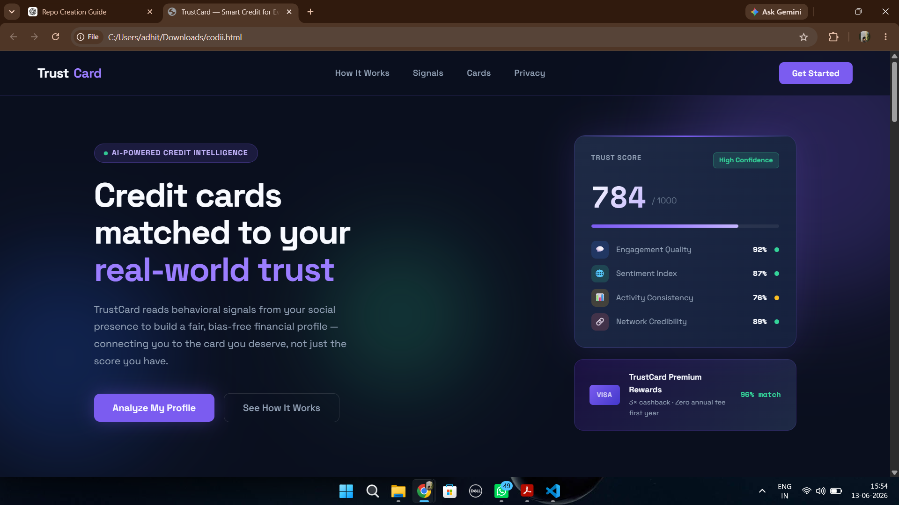

# Project Assets

This directory contains the visual resources and supporting materials used in the **TrustCard: AI-Powered Social Media-Based Credit Card Recommendation System**.

---

# System Architecture

The system architecture illustrates the complete workflow of the TrustCard platform, including:

* Social media data collection
* Data preprocessing and anonymization
* Trust and affluence signal extraction
* Score aggregation and creditworthiness evaluation
* Bias mitigation and fairness validation
* Credit card recommendation generation
* Feedback and continuous learning pipeline

This architecture serves as the foundation of the overall system design.

---

# Recommendation Workflow

The workflow diagram demonstrates the end-to-end recommendation process from user consent to final credit card recommendation.

Key stages include:

* User consent and privacy agreement
* Social, behavioral, and network signal collection
* Signal preprocessing and feature engineering
* Trust, affluence, responsibility, and network scoring
* Composite creditworthiness index generation
* Fairness validation and bias mitigation
* Credit card category recommendation
* Feedback-driven model improvement

---

# Technology Stack

The technology stack defines the tools and frameworks planned for system implementation.

Major categories include:

### Frontend

* React.js
* Next.js
* TypeScript

### Backend

* FastAPI
* Node.js
* Django Admin

### Machine Learning

* Scikit-Learn
* XGBoost
* PyTorch
* Hugging Face Transformers

### NLP & Computer Vision

* spaCy
* NLTK
* BERT/RoBERTa
* OpenCV

### Databases

* PostgreSQL
* MongoDB
* Redis
* Pinecone

### Cloud & DevOps

* Docker
* Kubernetes
* Terraform
* GitHub Actions
* AWS / GCP

---

# Frontend Prototype

The TrustCard frontend prototype demonstrates the planned user experience of the platform.

Implemented UI concepts include:

* Modern fintech-inspired interface
* Trust score visualization dashboard
* Behavioral signal insights
* Credit card recommendation cards
* Privacy-focused onboarding experience
* Explainable recommendation presentation

This prototype serves as the initial user-facing design for future frontend development.

---

## Project Status

✅ Research & Problem Definition Completed

✅ System Architecture Designed

✅ Workflow & Technology Stack Finalized

✅ Frontend Prototype Completed

🚧 Backend Development Planned

🚧 Machine Learning Pipeline Development Planned

---

Part of the TrustCard Project.

