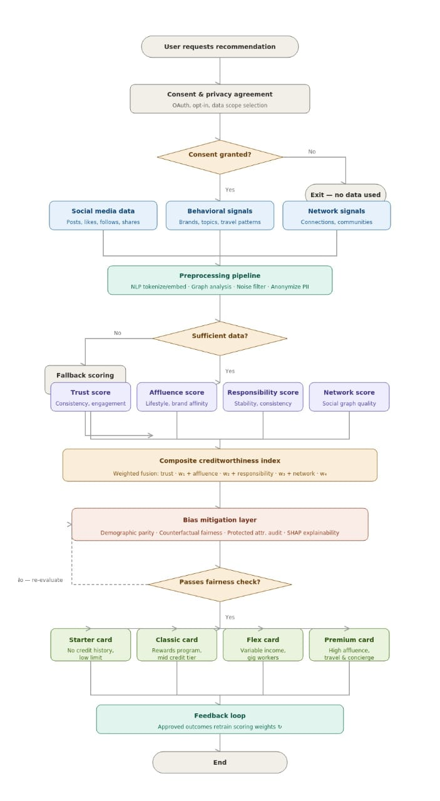
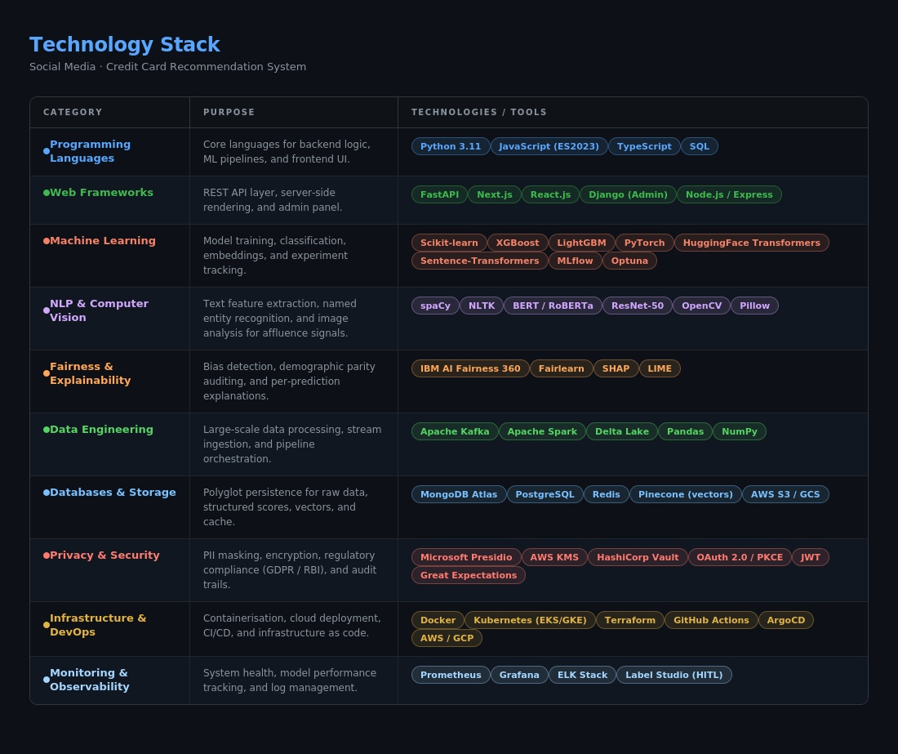

# Project Assets

This directory contains the visual resources and design artifacts used in the **TrustCard: AI-Powered Social Media-Based Credit Card Recommendation System**.

---

# System Architecture

The system architecture illustrates the complete design of the TrustCard platform.

Key components include:

* Data Collection Layer
* Data Preprocessing Layer
* Feature Extraction Layer
* Trust & Affluence Scoring
* Machine Learning Classification
* Fairness & Bias Mitigation
* Privacy & Compliance Validation
* Recommendation Dashboard
* Secure Storage & Audit Logging

This architecture serves as the foundation for the implementation of the recommendation system.

---

# Technology Stack

The technology stack outlines the tools and frameworks selected for developing the TrustCard platform.

Major categories include:

* Programming Languages
* Web Frameworks
* Machine Learning Libraries
* NLP & Computer Vision Tools
* Databases & Storage Solutions
* Privacy & Security Frameworks
* Cloud & DevOps Infrastructure
* Monitoring & Observability

The stack has been chosen to support scalability, explainability, fairness, and secure deployment.

---

# Frontend Prototype

The frontend prototype demonstrates the planned user experience of the TrustCard platform.

Highlighted features include:

* Trust score visualization
* Behavioral intelligence dashboard
* Credit card recommendation interface
* Modern fintech-inspired user experience
* Privacy-focused design
* Explainable recommendation presentation

This prototype represents the initial user-facing design of the project.

---

## Project Status

✅ Problem Statement Finalized

✅ System Architecture Designed

✅ Technology Stack Finalized

✅ Frontend Prototype Completed

🚧 Backend Development Planned

🚧 Machine Learning Pipeline Development Planned

---

Part of the TrustCard Project.
